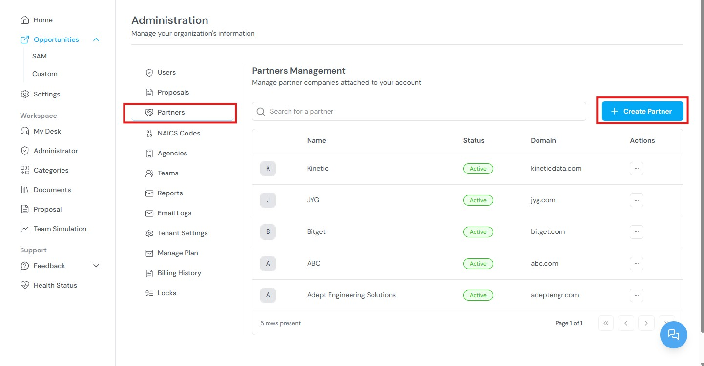
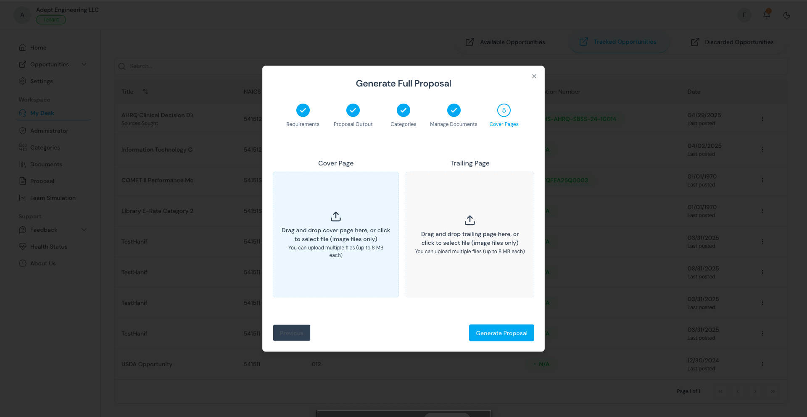

The Administrator Workspace provides organizational management tools for users, partners, teams, agencies, proposals, and platform configuration. This section is available only to users with the **Super Admin** or **Tenant Admin** role.

<Info>
  **Before you begin:** You must be logged in with a Super Admin or Tenant Admin account. Standard users do not have access to the Administrator panel.
</Info>

## Accessing the Administrator panel

1. Go to [app.kontratar.com](https://app.kontratar.com) and log in.
2. From the Home Dashboard, click **Administrator** in the left sidebar.

.jpg)

## Users

The Users section displays all members of your organization and provides account management controls.

.jpg)

**Super Admins** can:

- View a complete list of organization users
- Deactivate user accounts
- Offer Support Role access
- Reset user passwords

**Tenant Admins** can:

- Invite new users to the organization
- Deactivate user accounts
- Access proposal generation
- Manage team roles and permissions

<Note>
  Only one Tenant Admin is allowed per organization. The first person to register from a company becomes the primary admin.
</Note>

## Proposals

The Proposals section provides a centralized view of all proposals generated across your organization.

.jpg)

From this section, you can:

- View all proposals (drafts, in-progress, and completed)
- Track submission statuses
- Access any proposal for review

## Partners

The Partners section manages external organizations that your company collaborates with on contract opportunities.

For each partner, you can:

- Create and manage partner company profiles
- Upload capability statements (PDF or Word) that describe the partner's service strengths and opportunity focus
- Add and manage documents tied to each partner
- Add partner websites — Kontratar automatically scrapes public information from the website to support analysis
- Link opportunity categories to each partner

Use this section to match specific partners with contract types based on their past performance and capabilities.

## Agencies

The Agencies section manages the government agencies your organization tracks.

.jpg)

From this section, you can:

- Add, edit, or remove government agencies
- Maintain an up-to-date list of agencies your organization pursues
- Use agency names in filtering and proposal generation workflows

Agency configuration affects which opportunities are displayed in the Opportunities tab and Home Dashboard.

<Note>
  Changes to agency configuration take effect after 48 hours.
</Note>

## Teams

The Teams section manages internal groups assigned to contracts or tasks.

.jpg)

From this section, you can:

- Create teams based on department, role, or opportunity focus
- Assign team responsibilities for proposal workflows or partner coordination
- Add partners to a team

## Reports

The Reports section manages subscription-based notifications from selected agencies and partner organizations.

.jpg)

Subscribed users automatically receive the latest opportunities and announcements by email. You can configure report delivery by email or through in-app notifications.

## NAICS Code

The NAICS Code section controls which industry-classified opportunities appear in your dashboard and Opportunities tab.

.jpg)

Use this section to search for and add NAICS codes that match your organization's services. Opportunities are filtered based on the codes you configure here.

<Note>
  Changes to NAICS code configuration take effect after 48 hours.
</Note>

## Email Logs

Email Logs provide a record of all email activity between your organization and its recipients.

.jpg)

Use this section to confirm delivery status and review communication history.

## Tenant Settings

Tenant Settings allow you to configure auto-generated response settings and score requirements for proposals.

.jpg)

Use this section to set thresholds that control when proposals are automatically generated and what quality standards they must meet.

## Manage Plans

Manage Plans displays your current subscription details, including your payment plan, resource usage, and available features.

## Billing History

Billing History provides a record of all past invoices and payments.

.png)

Use this section to review transaction records and track account spending.

## Locks

Locks allow Tenant Admins to restrict access to specific features for security and control.

.png)

When a feature is locked, only authorized users can access that tool or setting.

## Related topics

- [Quick Start](/quickstart) — Account creation, including the primary admin registration process.
- [User Guide](/user-guide) — Complete reference for the Kontratar interface.
- [Passphrase](/securityCompliance/passphrase) — Setting up proposal encryption.
- [Multi-Factor Authentication](/securityCompliance/twofactor) — Enabling two-factor authentication for user accounts.

**Parent topic:** [Kontratar v1.2 Documentation](/)