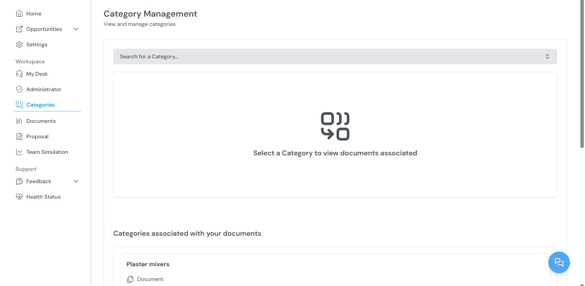

Categories are classification tags applied to documents and partner profiles. They support organization, search, and filtering across the platform.

## Available functions

From the Categories section, you can:

- View all existing categories in your organization
- Search for categories using keywords
- Add documents to specific categories
- Remove documents from categories

## How categories are used

Categories serve multiple purposes across the platform:

| Use case | Description |
| --- | --- |
| **Document organization** | Group related documents under a shared label for faster retrieval. |
| **Partner matching** | Link opportunity categories to partner profiles to match partners with contract types. |
| **Simulation input** | Categories help the simulation engine match your organization's capabilities with an opportunity's requirements. |
| **Proposal filtering** | Filter documents by category when selecting supplementary files during proposal generation. |

## Related topics

- [Documents](/Documents) — Uploading and managing company files.
- [Administrator Workspace](/AdministrationWorkspace) — Managing partner profiles and their linked categories.
- [Team Simulation](/TeamSimulation) — How categories support capability matching.

**Parent topic:** [Kontratar v1.2 Documentation](/)