<Info>
  **Before you begin:** To generate a proposal, you need:

  - A tracked opportunity in **My Desk** (see [Tracking Government Opportunities](/TrackOpportunities))
  - A completed company profile
  - Uploaded documents in the **Documents** section (past performance narratives, capability statements, and resumes improve output quality)
  - A configured passphrase (see [Passphrase](/securityCompliance/passphrase))
</Info>

## Generation types

Kontratar supports three types of proposal output:

| Type | What it produces | When to use it |
| --- | --- | --- |
| **Full Proposal** | A complete AI-generated draft with all sections | When you need a starting point for the full submission |
| **Table of Contents** | The structural outline of the proposal only | When you want to plan the proposal structure before writing |
| **Requirements Only** | Extracted requirements from the solicitation | When you want to write manual responses to each requirement |

The generation process below applies to all three types.

## How to generate a proposal

### Step 1: Select the opportunity

From **My Desk**, select the tracked opportunity you want to respond to. Click **Create Sources Sought Response**.

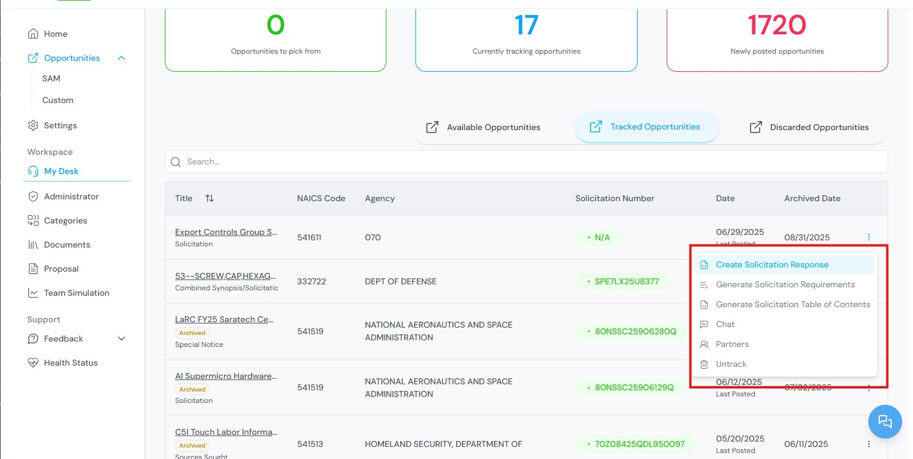

### Step 2: Select a profile

Select a company profile. This directs you to the requirements generation section.

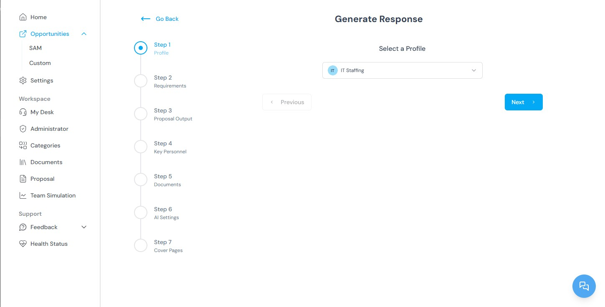

### Step 3: Review requirements

The platform extracts and displays the requirements from the solicitation. Review the requirements before proceeding.

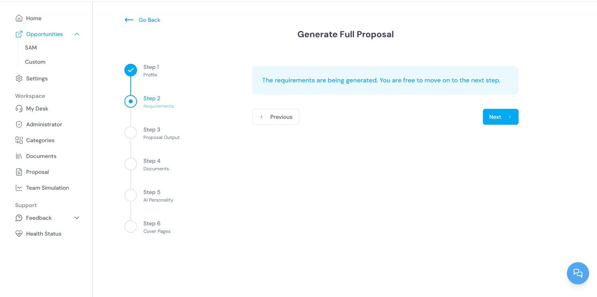

### Step 4: Configure proposal output

Once requirements are generated, you are taken to the Proposal Output page. Configure the following options:

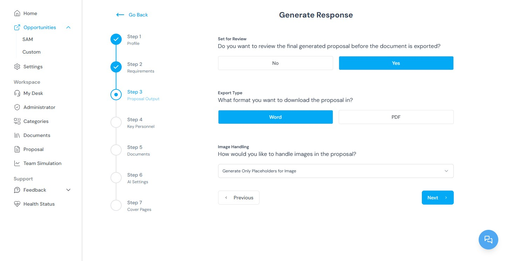

| Option | Description |
| --- | --- |
| **Set for review** | Choose **Yes** to mark the proposal for team review before finalization. |
| **Export format** | Select **Word (.docx)** or **PDF (.pdf)** for the output file. |
| **Image handling** | Choose to generate a placeholder for **one** image or **all** images in the proposal. |
| **Volume types** | Select which volumes (sections) to include in the proposal, based on your organization's preferences. |
| **Additional documents** | Optionally attach supplementary files to include in the generation process. |
| **AI personality** | Select the tone and style for the generated content. Different personalities produce different writing approaches. |

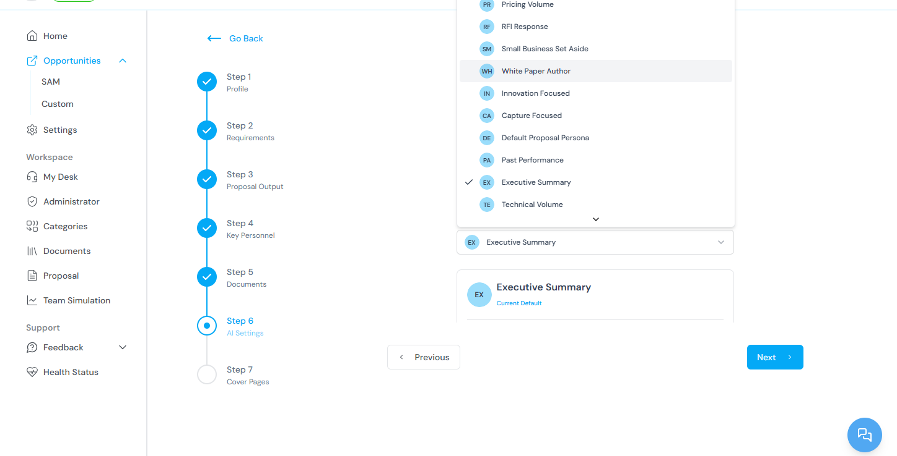

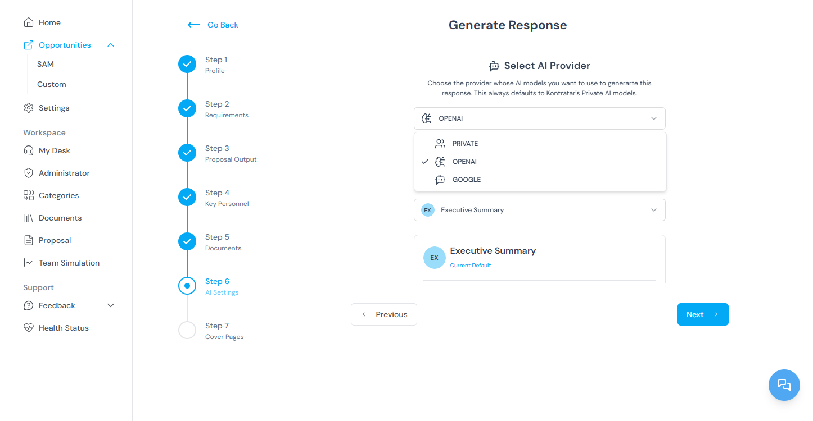

Select a **cover page** design for the proposal.

.png)

### Step 5: Generate the proposal

Click **Generate Proposal**. The platform compiles all sections and produces the document.

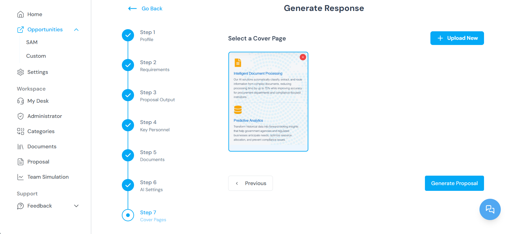

The completed proposal is saved to your dashboard. It remains accessible for editing, export, or additional revisions.

## Editing a proposal

### Step 1: Open Proposal Administration

From the Home Dashboard, select **Proposals** from the sidebar to access Proposal Administration. Navigate to the **Processed** section to find active proposals.

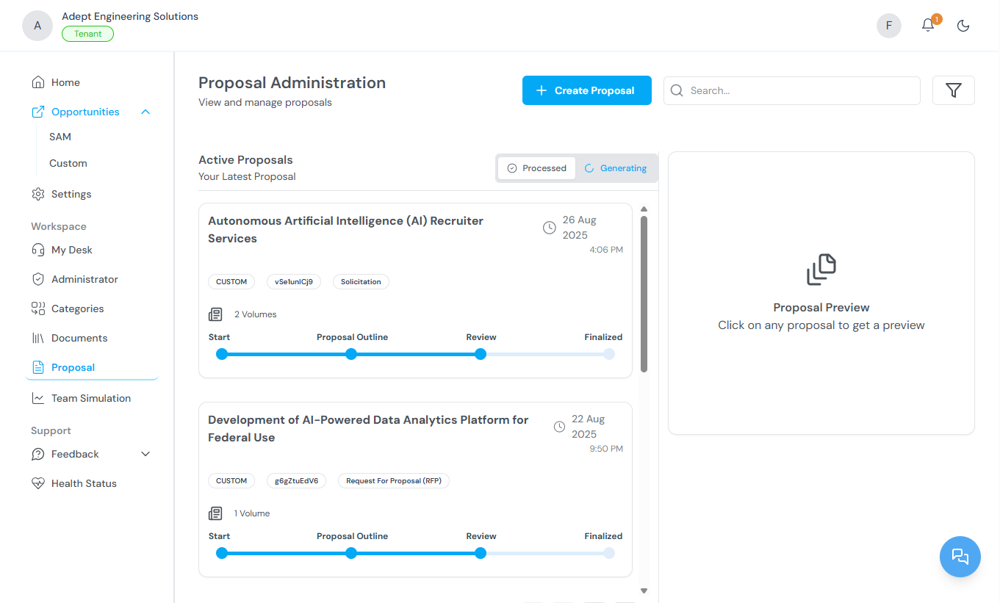

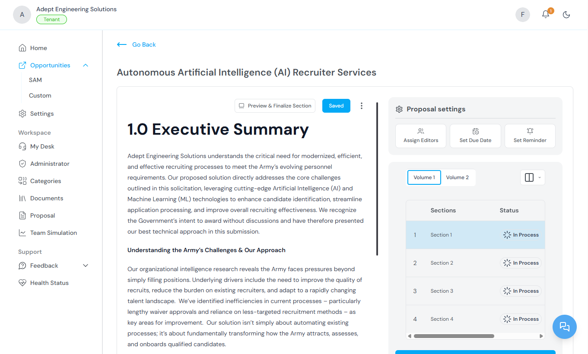

### Step 2: Enter edit mode

Click **Edit Proposal**. The system prompts you to enter your passphrase.

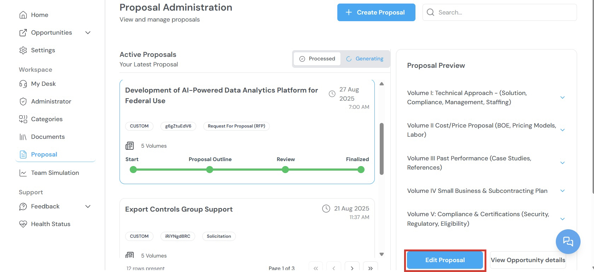

### Step 3: Enter your passphrase

Enter your tenant passphrase to access the proposal. This verifies your identity and restricts access to authorized users.

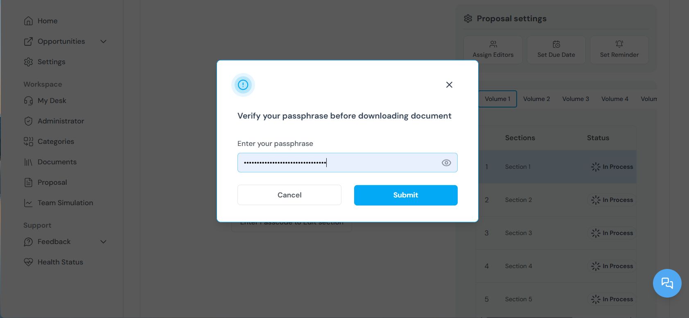

<Warning>
  If you forget your passphrase, your generated proposals cannot be recovered. Kontratar does not store the passphrase. See [Passphrase](/securityCompliance/passphrase) for details.
</Warning>

### Step 4: Navigate proposal sections

Proposals are organized into volumes or sections (for example, Executive Summary, Technical Approach, Past Performance). Use the side navigation panel to switch between sections. Each section is editable and displays real-time status indicators.

### Step 5: Manage editors

At the top of each section, a list of assigned editors is displayed. To add editors, click the editor dropdown and select team members with the appropriate access level. The platform maintains version control to track all changes and contributions.

### Step 6: Use the Actions tab

Click the **Actions** tab to access project management controls:

| Action | Description |
| --- | --- |
| **Due dates** | Set a due date for each proposal section. |
| **Deadlines** | Assign deadlines for individual contributors. |
| **Reminders** | Schedule reminders to keep team members on track. |

## Exporting a proposal

Once your proposal is complete:

1. Preview the full proposal.
2. Select which volumes or documents to include in the export.
3. Export the final version as **PDF** or **Word**.

All finalized proposals are saved for future access and tracking.

## Related topics

- [Tracking Government Opportunities](/TrackOpportunities) — How to track the opportunities used for proposal generation.
- [Team Simulation](/TeamSimulation) — Evaluating organizational fit before generating a proposal.
- [Documents](/Documents) — Uploading company files that improve proposal quality.
- [Passphrase](/securityCompliance/passphrase) — Setting up and managing your proposal encryption passphrase.
- [Administrator Workspace](/AdministrationWorkspace) — Managing proposals across the organization.

**Parent topic:** [Kontratar v1.2 Documentation](/)