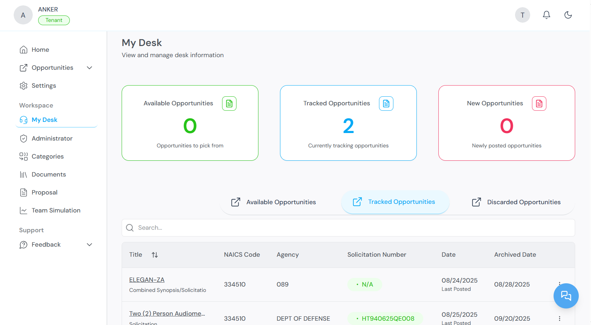

<Info>
  **Before you begin:** You must be logged in to Kontratar. If you do not have an account, see the [Quick Start](/quickstart).
</Info>

## Navigating to Opportunities

1. From the Home Dashboard, click **Opportunities** in the left sidebar.
2. The Opportunities section contains two tabs: **SAM** and **Custom**.

## SAM opportunities

The **SAM** tab displays federal contract opportunities sourced from SAM.gov (System for Award Management). SAM is the official U.S. government system for publishing contract solicitations.

To browse SAM opportunities:

1. Select the **SAM** tab.
2. Browse the available listings.
3. Click any opportunity to view its full details.

.png)

.png)

.png)

4. To track an opportunity, click **Track**. The opportunity moves to **My Desk** for follow-up.

.png)

### Filtering SAM opportunities

You can narrow results using the following filters:

| Filter | Description |
| --- | --- |
| **NAICS codes** | Filter by industry classification. Only opportunities matching your configured NAICS codes are shown by default. |
| **Government agency** | Filter by specific agency (for example, Department of Defense, GSA, Department of Health and Human Services). |
| **Date range** | Filter by posting date. Options include last 24 hours, last 7 days, and custom ranges. Available from the Home tab. |

You can also generate a proposal or create a response directly from any opportunity in the SAM tab.

## Custom opportunities

The **Custom** tab displays opportunities created manually by your organization. Use this tab for state or local government bids, commercial RFPs, or any solicitation not published on SAM.gov.

To manage custom opportunities:

1. Click the **Custom** tab.

.png)

2. View existing custom listings, or create a new one.
3. Click **Proceed to Track** to save a listing to My Desk.

.png)

.png)

4. Use the date filter to sort listings by recency.

You can filter custom opportunities by agency, NAICS code, and other criteria. You can also generate a proposal from any custom listing.

## My Desk

My Desk is your personal workspace for managing all opportunities you have acted on. It contains three tabs:

| Tab | Contents |
| --- | --- |
| **Available Opportunities** | Opportunities matching your filters that you have not yet tracked or discarded. |
| **Tracked Opportunities** | Opportunities you are actively pursuing. These are available for proposal generation and team simulation. |
| **Discarded Opportunities** | Opportunities you have removed from your pipeline. You can re-track a discarded opportunity at any time. |

From My Desk, you can:

- Generate proposals and begin proposal drafts for tracked opportunities
- Customize proposal content for each opportunity
- Generate a table of contents for each proposal

### Partners

Some contract opportunities require collaboration with external organizations. The Partners section within My Desk allows you to:

- View opportunities that may require teaming arrangements
- View ranking data for potential collaborators
- Manage partnership-based submissions
- Manage and edit partner profiles

### Discarded opportunities

All opportunities you have chosen to pass on are stored in the Discarded Opportunities tab. You can:

- Review previously discarded opportunities at any time
- Re-track an opportunity if it becomes relevant again

## What to do next

After tracking opportunities:

- Go to **My Desk** to review your tracked pipeline.
- Use [Team Simulation](/TeamSimulation) to evaluate your fit before committing to a bid.
- Use [Proposal Generation](/ProposalGeneration) to create a response for a tracked opportunity.

## Related topics

- [Quick Start](/quickstart) — Account creation and initial configuration.
- [Proposal Generation](/ProposalGeneration) — Creating proposals from tracked opportunities.
- [Team Simulation](/TeamSimulation) — Evaluating organizational fit.
- [Administrator Workspace](/AdministrationWorkspace) — Managing partners, agencies, and NAICS codes.

**Parent topic:** [Kontratar v1.2 Documentation](/)