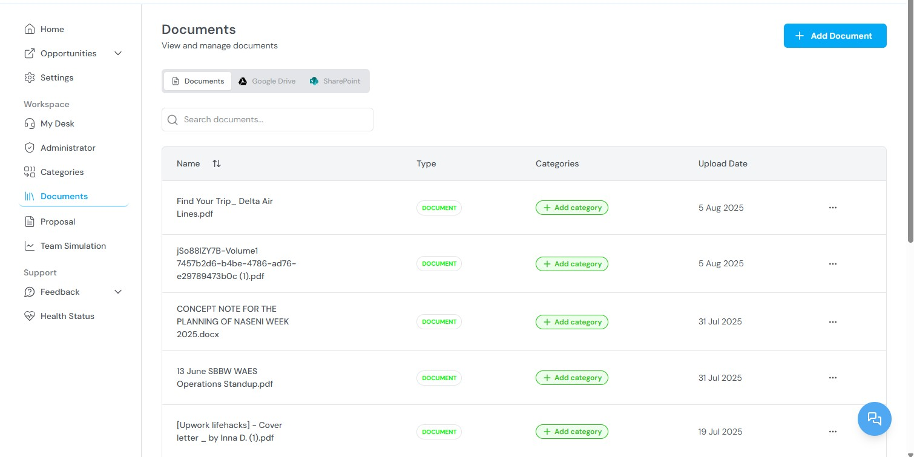

This guide describes the Kontratar interface and the function of each platform section. It covers navigation, core workflows, and the relationship between features. For step-by-step procedures, see the linked pages for each topic.

<Info>
  **For account setup and first login**, see the [Quick Start](/quickstart).
</Info>

## Platform workflow

Kontratar supports government contracting work across four stages:

| Stage | What happens | Platform features used |
| --- | --- | --- |
| **Discovery** | Opportunities are aggregated from SAM.gov and custom sources, filtered by NAICS code, agency, and date. | Opportunities (SAM tab, Custom tab), Home Dashboard |
| **Evaluation** | Your organization's capabilities are compared against an opportunity's requirements. | Team Simulation |
| **Proposal development** | A structured proposal is generated from the opportunity's solicitation data and your uploaded company documents. | Proposal Generation, Documents |
| **Management** | Proposals are edited, reviewed by team members, and exported as PDF or Word files. | Proposal Editing, Administrator workspace |

## Home Dashboard

The Home Dashboard displays after login. It contains:

- **Opportunity summary charts** filtered by your configured NAICS codes. These show the volume and distribution of active opportunities across agencies.
- **Award and forecast data** for your tracked industry sectors.
- **Performance metrics** for your tracked opportunities and proposals.

The data on this page reflects the NAICS codes configured in **Administrator \> NAICS Code**. Changes to NAICS codes take effect after 48 hours.

For instructions on configuring NAICS codes, see [Administrator Workspace](/AdministrationWorkspace).

## Opportunities

The Opportunities section contains two tabs:

### SAM tab

Displays federal contract opportunities sourced from SAM.gov (System for Award Management). SAM is the official U.S. government system for publishing contract solicitations, including RFIs, RFQs, RFPs, Sources Sought notices, and award notifications.

.png)

Each listing shows the solicitation title, agency, NAICS code, posted date, response deadline, and set-aside type. You can:

- Filter by NAICS code, agency, or date range
- Click any opportunity to view its full solicitation details
- Click **Track** to add the opportunity to My Desk
- Click **Discard** to remove it from your active view
- Generate a proposal or response directly from the opportunity detail screen

.png)

### Custom tab

Displays opportunities created manually by your organization. Use custom opportunities for state or local government bids, commercial RFPs, or solicitations not published on SAM.gov.

.png)

From the Custom tab, you can:

- View or create custom opportunity listings
- Click **Proceed to Track** to save a listing to My Desk
- Filter by date
- Generate a proposal from any custom listing

For full instructions, see [Tracking Government Opportunities](/TrackOpportunities).

## My Desk

My Desk is your personal workspace for managing opportunities you have acted on. It contains three tabs:

| Tab | Contents |
| --- | --- |
| **Available Opportunities** | Opportunities matching your filters that you have not yet tracked or discarded. |
| **Tracked Opportunities** | Opportunities you are actively pursuing. These are available for proposal generation and team simulation. |
| **Discarded Opportunities** | Opportunities you have removed from your active pipeline. You can re-track a discarded opportunity at any time. |

From My Desk, you can generate proposals and create proposal drafts for any tracked opportunity.

The **Partners** section within My Desk shows opportunities that may require teaming arrangements. You can view ranking data for potential collaborators and manage partnership-based submissions.

For full instructions, see [Tracking Government Opportunities](/TrackOpportunities).

## Proposal Generation

The Proposal Generation module creates structured proposal documents from tracked opportunities. It uses AI to analyze solicitation requirements and combine them with your company profile and uploaded documents.

### Generation types

| Type | Output | Use case |
| --- | --- | --- |
| **Full Proposal** | Complete AI-generated draft with all sections | Starting point for a full submission |
| **Table of Contents** | Structural outline of the proposal | Planning the proposal structure before writing |
| **Requirements Only** | Extracted requirements from the solicitation | Manual response to each requirement |

### Generation process

1. Select a tracked opportunity from My Desk.
2. Click **Create Sources Sought Response**.

3. Select a company profile.

4. Review the extracted requirements.

5. Configure the proposal output: export format (Word or PDF), image handling, volume types, AI personality, additional documents, and cover page design.

6. Click **Generate Proposal**.

The completed proposal is saved to your dashboard and can be edited, exported, or shared with team members.

### Editing proposals

Proposals are edited through a passphrase-protected environment. Each proposal is organized into volumes or sections (for example, Executive Summary, Technical Approach, Past Performance). Editors can be assigned to specific sections, and the platform tracks all changes with version control.

The Actions tab provides project management controls: due dates, contributor deadlines, and reminders.

For full instructions, see [Proposal Generation](/ProposalGeneration).

## Team Simulation

Team Simulation evaluates how well your organization or a teaming partner meets a specific opportunity's requirements. The system analyzes your uploaded documents, company profile, and partner data against the opportunity's solicitation.

### Running a simulation

1. Go to the **Simulation** section in the Workspace panel.

.png)

2. Click **Generate Simulation**.

.png)

3. Enter a simulation title.

.png)

4. Select the opportunity source: SAM or Custom.

.png)

5. Select the specific opportunity.
6. Select the client (your company or a partner).

.png)

7. Click **Generate**.

The results show the extracted requirements for the selected opportunity and a capability assessment based on your uploaded data. You can run multiple simulations against different partners to compare alignment.

.jpg)

For full instructions, see [Team Simulation](/TeamSimulation).

## Documents

The Documents section stores files uploaded by your organization. These files are used by the AI during proposal generation and team simulation. The more relevant the uploaded documents, the more accurate the generated output.

Available functions:

- View all previously uploaded documents
- Upload new documents (past performance narratives, capability statements, resumes, certifications)
- Tag documents with categories for organization and filtering
- Reuse documents across multiple opportunities

For category management, see [Categories](/Categories).

## Categories

Categories are classification tags applied to documents and partner profiles. They support organization, search, and filtering across the platform.

Available functions:

- View all existing categories
- Search categories by keyword
- Add or remove documents from categories

Categories are also used in simulations to match capabilities with contract types and in partner selection workflows.

## Administrator

The Administrator panel is visible only to Super Admins and Tenant Admins. It contains the following sections:

.jpg)

| Section | Function |
| --- | --- |
| **Users** | View organization users, invite new users, deactivate accounts, reset passwords, assign roles. Super Admins can offer support roles. Tenant Admins can invite users and manage team roles. |
| **Proposals** | View and manage all proposals generated across the organization. Track drafts, submissions, and statuses. |
| **Partners** | Create and manage partner company profiles. Upload capability statements, add partner websites (Kontratar scrapes public information for analysis), and link opportunity categories. |
| **Agencies** | Add, edit, or remove government agencies your organization tracks. Agency configuration affects which opportunities are displayed. Changes take effect after 48 hours. |
| **Teams** | Create internal teams by department, role, or opportunity focus. Assign team responsibilities and add partners to teams. |
| **Reports** | Subscribe to updates from selected agencies or partners. Reports are delivered by email or in-app notification. |
| **NAICS Code** | Search and configure NAICS codes to control which industry-classified opportunities appear in your dashboard. |
| **Email Logs** | View all email activity between your organization and recipients. Provides delivery confirmation and communication history. |
| **Tenant Settings** | Configure auto-generated response settings and score requirements for proposals. |
| **Manage Plans** | View your current subscription plan, resource usage, and available features. |
| **Billing History** | View past invoices and payment records. |
| **Locks** | Restrict access to specific features for security. Only authorized users can access locked tools and settings. |

<Note>
  Only one Tenant Admin is allowed per organization.
</Note>

For full instructions, see [Administrator Workspace](/AdministrationWorkspace).

## Settings

The Settings page controls workspace-level configuration:

- **NAICS codes** — Add or remove codes to change which opportunities are displayed.
- **Notifications** — Configure how and when alerts are delivered for new opportunities, amendments, and deadlines.
- **Display preferences** — Adjust workspace layout and view options.

## Support

Click the **Support icon** in the bottom-right corner of any screen to access help resources, product documentation, and customer support contact options.

For issue reporting and feature requests, see [Maintenance and Support](/Maintenanceandsupport).

## Related topics

- [Quick Start](/quickstart) — Account creation and initial configuration.
- [Tracking Government Opportunities](/TrackOpportunities) — Browsing, filtering, and tracking opportunities.
- [Proposal Generation](/ProposalGeneration) — Creating proposals from tracked opportunities.
- [Team Simulation](/TeamSimulation) — Evaluating organizational fit for specific opportunities.
- [Administrator Workspace](/AdministrationWorkspace) — Managing users, partners, teams, and settings.
- [FAQ](/FAQs) — Common questions about Kontratar.

**Parent topic:** [Kontratar v1.2 Documentation](/)